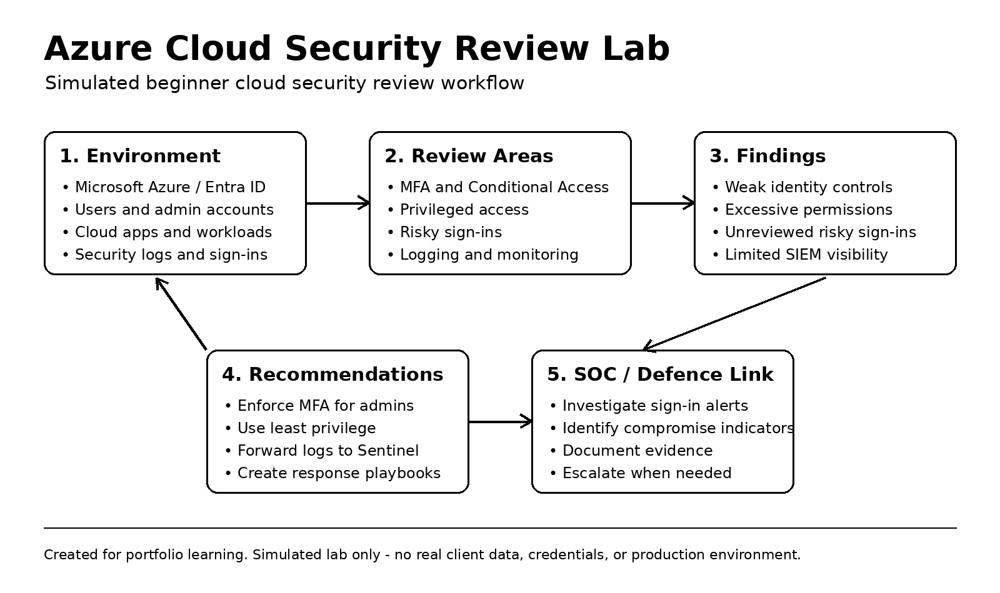

# Azure Cloud Security Review Lab

## Project Overview

This project is a beginner-friendly cloud security review lab focused on Microsoft Azure, Microsoft Entra ID, identity security, privileged access, MFA, Conditional Access, risky sign-ins, and basic cloud security recommendations.

The purpose of this lab is to demonstrate how a junior cloud security, cyber security, SOC, or consulting analyst might review a small cloud environment, identify common security risks, document findings, and recommend practical improvements.

This is a simulated documentation-based lab designed for learning, portfolio development, and interview preparation.

---

## Why I Created This Project

My long-term goal is to develop in Cyber Defence, Managed Security Services, SOC-style work, and Microsoft security technologies. As modern security operations increasingly depend on cloud environments, identity, access control, and secure configuration, I created this project to connect my SOC learning with cloud security fundamentals.

This project helps me practise:

- Cloud security review methodology
- Microsoft Entra ID security concepts
- MFA and Conditional Access risk reduction
- Privileged access review
- Risk documentation
- Security recommendations
- Incident response thinking
- Clear technical documentation

---

## Scenario

A small organisation uses Microsoft Azure and Microsoft Entra ID for identity and cloud access management.

The organisation has asked for a basic cloud security review to identify common risks and provide practical recommendations to improve its security posture.

The review focuses on identity and access security, because account compromise is one of the most common entry points for attackers.

---

## Areas Reviewed

1. MFA enforcement
2. Privileged account protection
3. Conditional Access
4. Risky sign-ins
5. Inactive user accounts
6. Excessive permissions
7. Admin account separation
8. Security logging and monitoring
9. Microsoft Sentinel logging concepts
10. Basic incident response actions for account compromise

---

## Repository Structure

```text
azure-cloud-security-review-lab/
├── README.md
├── cloud-security-review.md
├── entra-id-security-checklist.md
├── risk-register.md
├── recommendations.md
├── incident-response-notes.md
├── interview-summary.md
└── linkedin-post.md
```

---

## Key Skills Demonstrated

- Cloud security fundamentals
- Microsoft Azure security awareness
- Microsoft Entra ID identity security
- MFA and Conditional Access understanding
- Privileged access review
- Risk assessment
- Incident response thinking
- SOC and cloud security connection
- Documentation and reporting
- Security consulting mindset

---

## Tools and Concepts Referenced

- Microsoft Azure
- Microsoft Entra ID
- Microsoft Sentinel
- Microsoft Defender
- MFA
- Conditional Access
- Risky sign-ins
- Privileged access
- Identity and access management
- Incident response
- Risk register
- Security controls

---

## Project Workflow Diagram

This diagram shows the simulated workflow used in this cloud security review lab, from reviewing the cloud environment to identifying risks, documenting recommendations, and linking cloud security findings to SOC and Cyber Defence work.


---

## Disclaimer

This is a simulated beginner cloud security review lab created for educational and portfolio purposes. It does not contain real client data, real production credentials, or any sensitive information.
